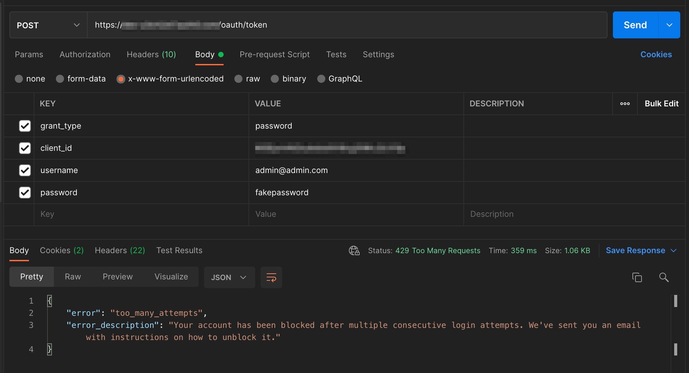
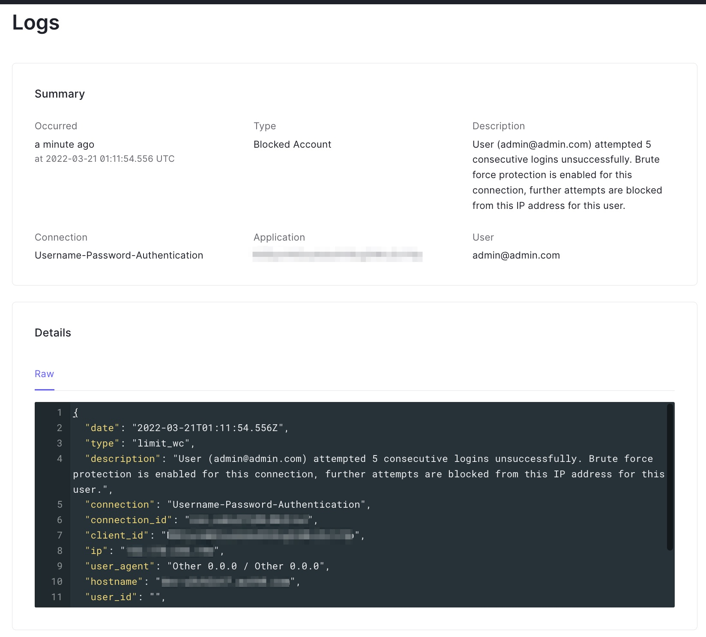
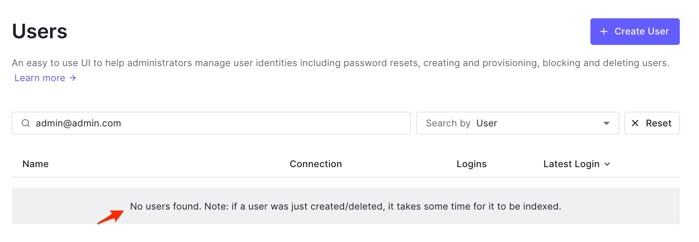

# Auth0 valid blocked users - Serverless deployment

Auth0 valid blocked users is an integration and automation to cover a limitation to identify auth0 valid users after a brute force attack. It is deployed using serverless framework in AWS. It uses different AWS services as: Event Brigde, Lambda, Secrets Manager, CloudWatch, etc, you can check [AWS Architecture diagram](#aws-architecture-diagram).

## Table of contents

* [Limitation](#limitation)
* [Flowchart](#flowchart)
* [AWS Architecture diagram](#aws-architecture-diagram)
* [How to deploy the automation](#how-to-deploy-the-automation)
  * [Requirements](#requirements)
  * [Steps](#steps)
* [Donations](#coffee-donations)
* [Contributors](#contributors)
* [Contributing](#contributing)
* [License](#license)

## Limitation

Auth0 brute force protection generates a log after an email is blocked, the limitation is that it doesn't verify if the email blocked is a valid auth0 user in the tenant. So if you need analyze the valid users after a brute force attack you need to do manual tasks or create a script.

**Example**

**Step1.- Brute force attack**

**Step2.- Auth0 log**

**Step3.- No user found**

## Flowchart

## AWS Architecture Diagram

## How to deploy the automation

### Requirements

* AWS account
* Auth0 tenant

### Steps

## :coffee: Donations

Thanks for your donations, are always appreciated.

While I drink the coffee I think new ideas to develop.

## Contributors

Thank you to all our [contributors](https://github.com/aaaguirrep/auth0-valid-blocked-users/graphs/contributors)!

## Contributing

[Contributing Guide](CONTRIBUTING.md)

## :chart_with_upwards_trend: Stargazers over time

## License

[MIT](LICENSE)

Copyright (c) 2020, Arsenio Aguirre
