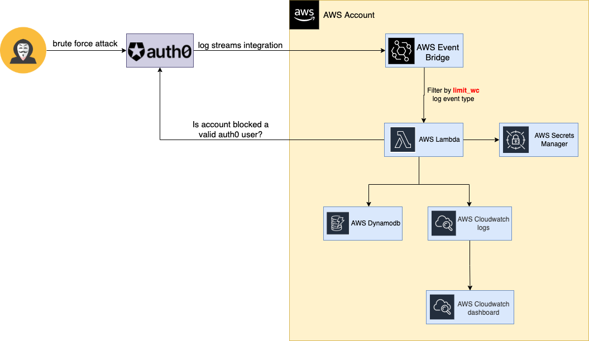

# Table of contents

* []

## Limitation

## Flowchart

## AWS Architecture Diagram

## Creating the service

## :coffee: Donations

Thanks for your donations, are always appreciated.

While I drink the coffee I think new ideas to develop.

## Contributors

Thank you to all our [contributors](https://github.com/aaaguirrep/auth0-valid-blocked-users/graphs/contributors)!

## Contributing

[Contributing Guide](CONTRIBUTING.md)

## :chart_with_upwards_trend: Stargazers over time

## License

[MIT](LICENSE)

Copyright (c) 2020, Arsenio Aguirre
